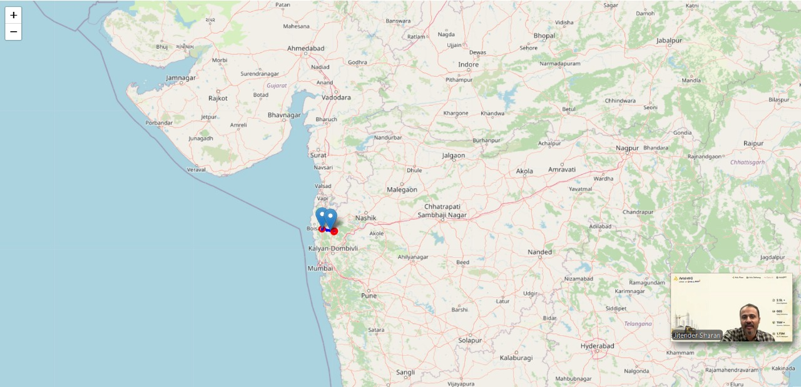
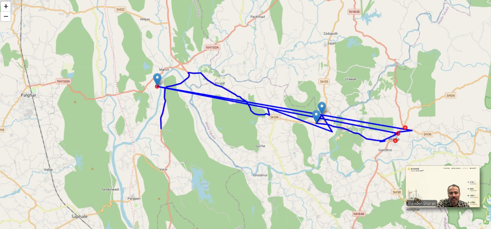

# Problem 2: GPS Data Processing

**Screenshots:**

## 1. Approach
1. **Jitter Removal:** I calculated the speed between consecutive points using the Haversine formula (via `geolib`). If the speed exceeded 120 km/h (unrealistic for this context), the point was discarded as noise.
2. **Idling Detection:** If speed dropped below 3 km/h for more than 120 seconds, the start of that sequence is marked as an idling point.
3. **Visualization:** The code generates an `output_map.html` file using Leaflet.js to render the clean path (blue), jitters (red), and idling spots (markers).

## 2. AI Declaration
**AI Tool Used:** Gemini
**Usage:** Used to generate the HTML boilerplate for Leaflet.js integration. The core filtering logic is native Node.js.

## 3. How to Run
1. Install dependencies:
   npm install
2. Ensure `sample_input.json` is in this folder (valid JSON format).
3. Run:
   node solution.js
4. Open `output_map.html` in any web browser.

## 4. Sample Execution Log
**Input:** File: sample_input.json (Contains raw GPS points with noise)

**Output (Console):**
Processing Complete.
- Clean points: 68
- Jitters removed: 2
- Idling events: 1
Map generated at: output_map.html

**Output (Visual):**
An HTML file (output_map.html) is generated showing:
- Blue Line: Smooth path
- Red Dots: Rejected noise points
- Markers: Idling locations

## 5. Time & Space Complexity
- Time Complexity: O(n) - Each GPS point is processed once.
- Space Complexity: O(n) - Storing processed points and generating the map data.